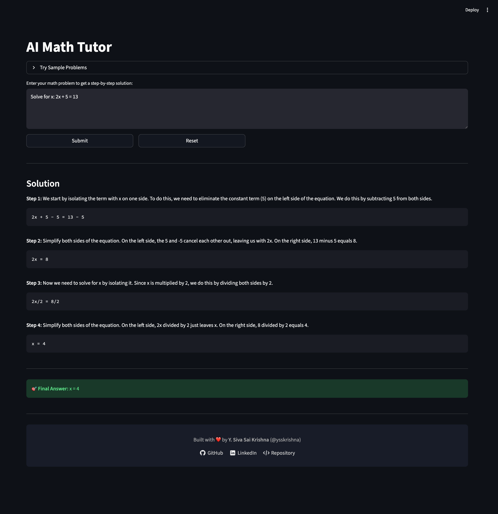
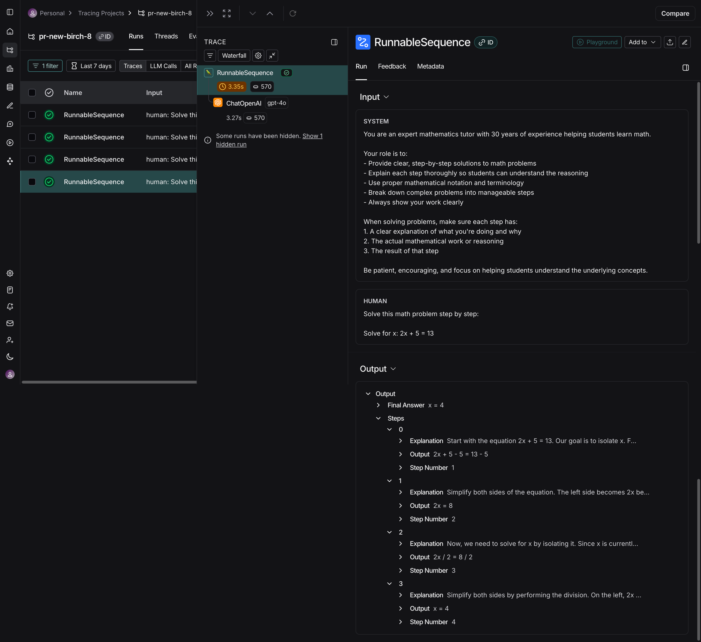

# AI Math Tutor

[](https://www.python.org/downloads/)
[](https://streamlit.io/)
[](https://openai.com/)
[](https://langchain.com/)
[](https://smith.langchain.com/)
[](https://pydantic.dev/)
[](https://docs.astral.sh/uv/)
[](LICENSE)


An intelligent AI-Powered Math Tutor that delivers clear, step-by-step solutions to mathematical problems. Built with **Streamlit** for an intuitive and interactive interface, it integrates **LangChain** for seamless LLM workflows, leverages **LangSmith** for advanced observability and tracing, and ensures reliability with **Pydantic’s type-safe** data models.


## 📌 Features

- **Step-by-Step Solutions**: Get detailed, educational solutions to math problems with clear explanations
- **Interactive Web Interface**: Clean, user-friendly Streamlit-based UI with modern design
- **LangChain Integration**: Built on LangChain for robust AI application development
- **LangSmith Observability**: Advanced tracing and monitoring with LangSmith for debugging and optimization
- **Type Safety with Structured Outputs**: Pydantic models ensure data validation, type checking, and structured outputs for supported llms.
- **UV Dependency Management**: Utilizes UV for efficient and fast dependency resolution and management.
- **Sample Problems**: Try pre-loaded example problems to get started quickly

## 📸 Demo

### Math Reasoning  - Step by Step Solution


### LangSmith Tracing - For Advanced Monitoring



## 🚀 Quick Start

### **Prerequisites**
- Python 3.11 or higher
- OpenAI API key
- UV package manager
- LangSmith is optional. Without it, tracing will be disabled but the core tutor works fine

### **1. Clone the Repository**

```bash
git clone https://github.com/ysskrishna/ai-math-tutor.git
cd ai-math-tutor
```

### **2. Install Dependencies**

```bash
# Install UV if you haven't already
curl -LsSf https://astral.sh/uv/install.sh | sh

# Install project dependencies
uv sync
```

### **3. Get OpenAI API Key**

1. Visit [OpenAI Platform](https://platform.openai.com/api-keys)
2. Sign in to your OpenAI account (or create one if you don't have it)
3. Click "Create new secret key"
4. Copy the generated API key

### **4. Set Up Environment**

Create a `.env` file in the project root. Use `.env.sample` as a reference:

```bash
OPENAI_API_KEY=your_openai_api_key_here
```

> **Note**: Check `.env.sample` for the complete list of environment variables and their descriptions.

### **5. Run the Application**

```bash
uv run streamlit run main.py
```

### **6. Open in Browser**

Visit **[http://localhost:8501](http://localhost:8501)**

## 📂 Project Structure

```
ai-math-tutor/
├── ai/                          # AI analysis logic
│   ├── client.py               # OpenAI client configuration
│   ├── prompts.py              # Prompt templates for tutoring logic
│   └── tutor.py                # Main tutoring logic
├── core/                       # Core application logic
│   ├── config.py              # Configuration and environment setup
│   └── models.py              # Pydantic models for structured output
├── media/                      # Screenshots and assets
├── .env.sample                 # Environment variables template
├── main.py                     # Main Streamlit application
├── pyproject.toml             # Project configuration and dependencies
└── README.md                  # This file
```

## 📚 Additional Resources

- [LangSmith Documentation](https://docs.langchain.com/langsmith/home) - Official documentation for observability and tracing
- [LangSmith Tracing Guide](https://docs.langchain.com/langsmith/observability-quickstart) - Learn how to trace your LLM applications
- [LangChain Documentation](https://python.langchain.com/docs/introduction/) - Comprehensive guide to LangChain


## 🤝 Contributing

1. Fork the repository
2. Create a feature branch (`git checkout -b feature/amazing-feature`)
3. Commit your changes (`git commit -m 'Add amazing feature'`)
4. Push to the branch (`git push origin feature/amazing-feature`)
5. Open a Pull Request

## 📜 License

This project is released under the **MIT License**.
See [LICENSE](LICENSE) for details.

## 👨‍💻 Author

**Y. Siva Sai Krishna** ([@ysskrishna](https://github.com/ysskrishna))

Built with ❤️ to make math easier to understand.